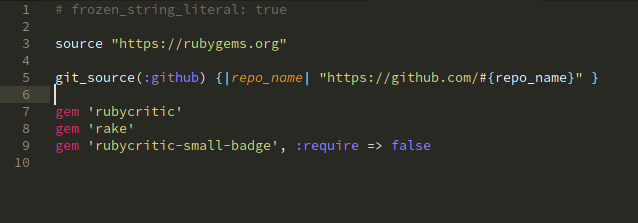
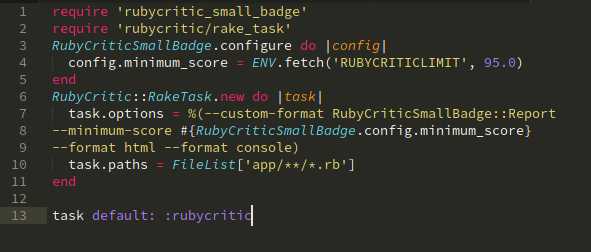
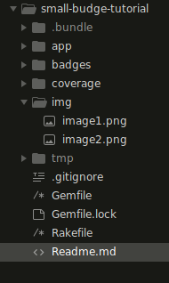

# Tutorial para utilizar rubycritic-small-badge
[]

En este pequeño tutorial, se hará una prueba para generar la insignia con el puntaje dado por rubycritic.

## Dependencias

***Bundler***
Bundler es una gema para generar entornos de trabajo, para no tener que instalar las gemas en el directorio del sistema y no generar futuros probleas entre las versiones de las gemas.
Ver más en [Bundler](https://bundler.io/)

Para instalar bundler ejecute:
```sh
$ gem install bundler
```
Al momento de comenzar un nuevo proyecto, coloquese en su carpeta y ejecute
```sh
$ bundle init
```
Al hacerlo, se generará un archivo llamado Gemfile, en el cual se agregarán las gemas nesesarias para crear el proyecto


***Rake***
Rake es un programa tipo `Makefile` implementado en Ruby. Las tareas y dependencias se especifican en la sintaxis estándar de Ruby.
Ver más en [Rake](https://ruby.github.io/rake/)

Para instalarlo, agreguesé al `Gemfile`

```sh
7	----
8	gem 'rake'
9	----
```
y después ejecute
```sh
$ bundle install
```

***RubyCritic***
RubyCritic es una gema que envuelve gemas de análisis estático como Reek, Flay y Flog para proporcionar un informe de calidad de su código Ruby.
Ver más en [RubyCritic](https://github.com/whitesmith/rubycritic)

En mi caso, se instaló a través de bundle agregando la gema a mi `Gemfile`

```sh
8	 ----
9	 gem 'rubycritic'
10	 ----
```
y después ejecuté
```sh
$ bundle install
```

## Instalación
Para poder usar rubycritic-small-badge, se editó el archivo `Gemfile` agregando lo siguiente:
```sh
9 	----
10	gem 'rubycritic-small-badge', :require => false
11	----
```
Quedando mi `Gemfile` de la siguiente manera
[]

Y después, para instalar las dependencias, en su consola, ejecute
```sh
$	bundle install
```  
## Ejecución de la gema
Después haciendo referencia al [repositorio](https://github.com/MarcGrimme/rubycritic-small-badge/blob/master/Rakefile), se creó el agregaron las siguientes lineas al archivo `Rakefile`

```sh
require 'rubycritic_small_badge'
require 'rubycritic/rake_task'
RubyCriticSmallBadge.configure do |config|
  config.minimum_score = ENV.fetch('RUBYCRITICLIMIT', 95.0)
end
RubyCritic::RakeTask.new do |task|
  task.options = %(--custom-format RubyCriticSmallBadge::Report
--minimum-score #{RubyCriticSmallBadge.config.minimum_score}
--format html --format console)
  task.paths = FileList['app/**/*.rb']
end

task default: :rubycritic
```
Quedando de la siguiente manera
[]

Para poder ejecutar el archivo `Rakefile` ejecute
```sh
$ bundle exec rake
```

Y se generará una carpeta llamada `badges` en su directorio de trabajo como se muestá a continuación
[]

La carpeta contendrá la insignia con el puntaje obtenido en `RubyCritic`
[]

Nota:
---
En la linea `10`, `task.paths = FileList['app/**/*.rb']`, apunta a mi carpeta `app` donde se encuentran mis archivos del proyecto, puede modificarse para apuntar a cualquier carpeta que usted elija como su proyecto
